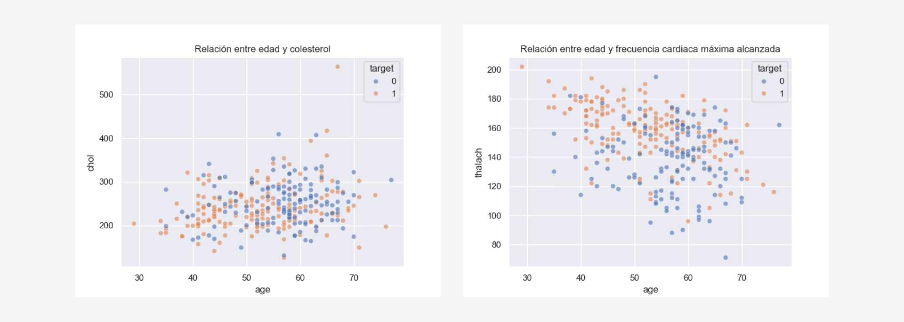
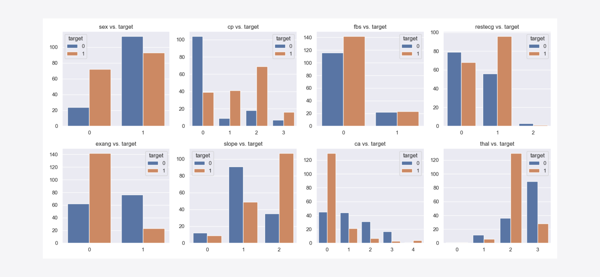
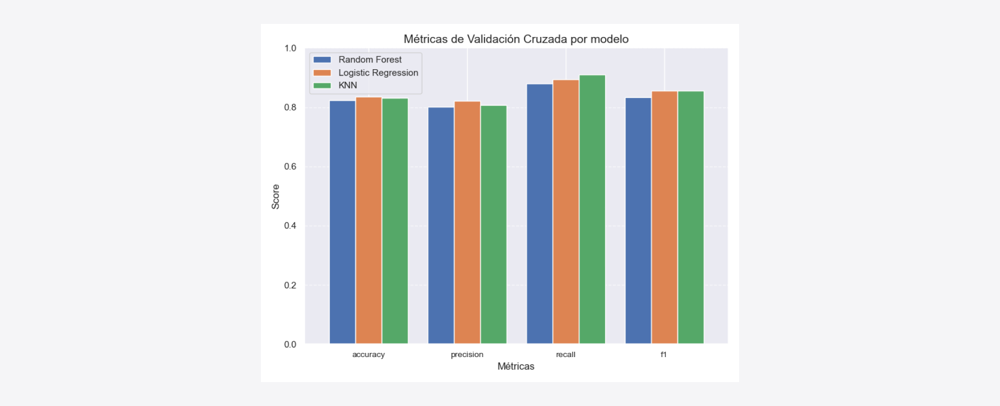
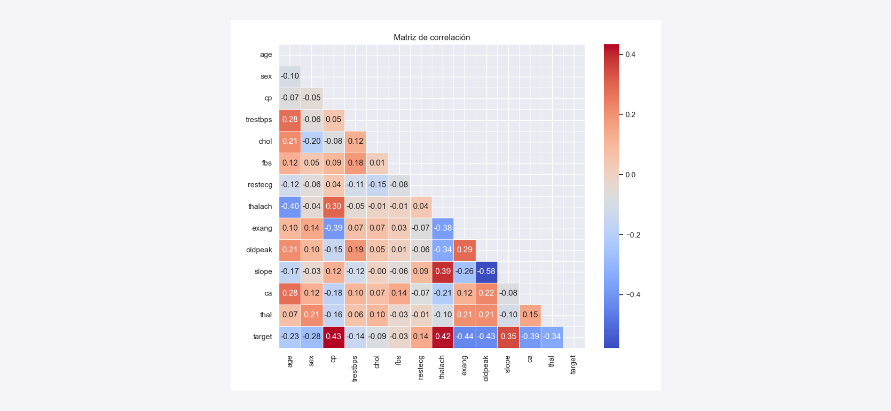

# Predicción de Enfermedades Cardíacas con ML

En este proyecto se implementó un flujo completo de trabajo en Machine Learning para abordar un problema de **clasificación binaria** utilizando un dataset relacionado con **enfermedades cardíacas**. El objetivo principal fue construir y evaluar modelos de Machine Learning capaces de predecir la presencia de enfermedad cardíaca en base a un conjunto de características clínicas.



## Objetivos del Proyecto

1. Desarrollar un modelo de machine learning robusto para predecir enfermedades cardíacas.
2. Analizar y preprocesar los datos mediante técnicas de EDA y escalado.
3. Entrenar y comparar diferentes modelos de clasificación.
4. Ajustar hiperparámetros para optimizar el rendimiento de los modelos.
5. Implementar técnicas avanzadas como combinación de modelos mediante **Voting Classifier** y **Stacking Classifier**.

## Conjunto de Datos

- **Fuente Original**: [Repositorio de Machine Learning de UCI](https://archive.ics.uci.edu/dataset/45/heart+disease)
- **Fuente Alternativa**: [Kaggle - Heart Disease Dataset](https://www.kaggle.com/datasets/sumaiyatasmeem/heart-disease-classification-dataset)
- **Estructura**:
  - 303 registros
  - 14 características (13 independientes + 1 objetivo)

| Característica | Descripción                                                                                            |
| -------------- | ------------------------------------------------------------------------------------------------------ |
| `age`          | Edad (años)                                                                                            |
| `sex`          | Género (1=Hombre, 0=Mujer)                                                                             |
| `cp`           | Tipo de dolor torácico (0-3)                                                                           |
| `trestbps`     | Presión arterial en reposo (mm Hg)                                                                     |
| `chol`         | Colesterol sérico (mg/dl)                                                                              |
| ...            | Ver el [diccionario de datos](https://archive.ics.uci.edu/dataset/45/heart+disease) para más detalles. |



## Flujo de Trabajo

1. **Análisis Exploratorio de Datos (EDA)**:

   - Distribución de las variables categóricas y numéricas.
   - Matriz de correlación.
   - Análisis de outliers.
   - Resultados disponibles en [EDA.md](docs/eda.md).

2. **Ingeniería de Características**:

   - Escalado de características numéricas.
   - Generación de visualizaciones como la importancia de características de Random Forest y Regresión Logística.

3. **Entrenamiento de Modelos**:

   - Modelos probados:
     - Random Forest
     - Logistic Regression
     - K-Nearest Neighbors (KNN)
   - Configuración de hiperparámetros usando `RandomizedSearchCV` y `GridSearchCV`.

4. **Evaluación de Modelos**:

   - Validación cruzada con y sin estratificación.
   - Métricas clave: Accuracy, Precision, Recall, F1-Score y ROC-AUC.

5. **Combinación de Modelos**:
   - Implementación de un Voting Classifier y Stacking Classifier.

## Resultados

- **Modelo final seleccionado**: Random Forest

  - Métricas destacadas (estratificación):
    - Accuracy: 0.84
    - F1-Score: 0.87
    - ROC-AUC: 0.91
  - Las características más importantes según Random Forest incluyen:
    - `cp`, `thal`, `ca`, `oldpeak`, `thalach`.

- **Combinación de Modelos**:
  - **Voting Classifier**:
    - Precisión sin estratificación: 0.89
    - Precisión con estratificación: 0.80
  - **Stacking Classifier**:
    - Precisión sin estratificación: 0.89
    - Precisión con estratificación: 0.80

## Estructura del Proyecto

```
heart-disease-prediction/
├── data/                           # Datos originales y procesados
├── notebooks/                      # Jupyter Notebooks
│   ├── 1-data-exploration.ipynb    # EDA
│   ├── 2-modeling.ipynb            # Modelado sin estratificación
│   └── 2-modeling-stratify.ipynb   # Modelado con estratificación
│
├── src/                       # Código fuente
│   ├── data_processing.py     # Funciones para preprocesamiento
│   ├── model_training.py      # Funciones para entrenamiento
│   ├── evaluation.py          # Funciones para evaluación
│   └── utils.py               # Utilidades generales
│
├── docs/                      # Documentación
│   ├── eda.md                 # Análisis Exploratorio de Datos
│   ├── results.md             # Informe de Resultados
│   └── readme.md              # Descripción general del proyecto
│
├── models/                    # Modelos entrenados
├── assets/                    # Gráficos y recursos visuales
├── README.md                  # Resumen del proyecto
└── requirements.txt           # Dependencias
```

## Reproducibilidad

1. Clonar el repositorio:

   ```bash
   git clone https://github.com/username/heart-disease-prediction.git
   ```

2. Crear y activar el entorno:

   ```bash
   conda env create --prefix ./env -f environment.yml
   conda activate ./env
   ```

3. Ejecutar el código:
   ```bash
   python src/main.py
   ```

## Conclusión final

Aunque los tres modelos analizados (Random Forest, Logistic Regression y KNN) mostraron un rendimiento similar, **Random Forest** fue seleccionado como el modelo final por su equilibrio en métricas y capacidad para manejar relaciones no lineales. Este análisis proporciona una base sólida para futuras aplicaciones o mejoras en proyectos relacionados con predicción en el ámbito médico.




