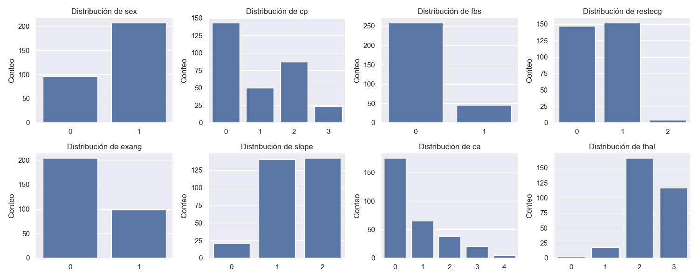
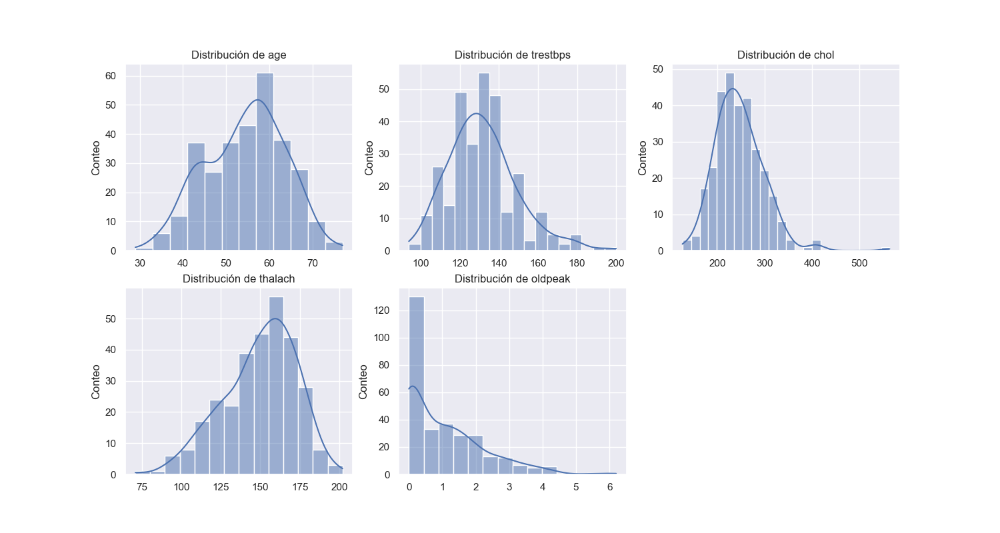
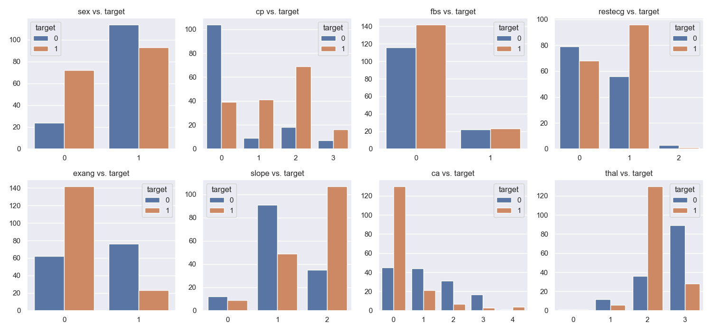
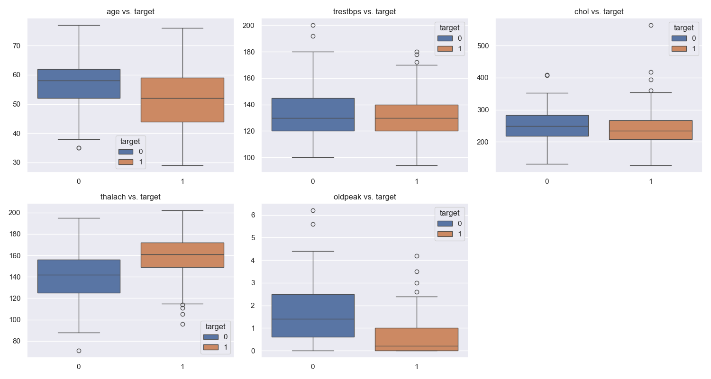
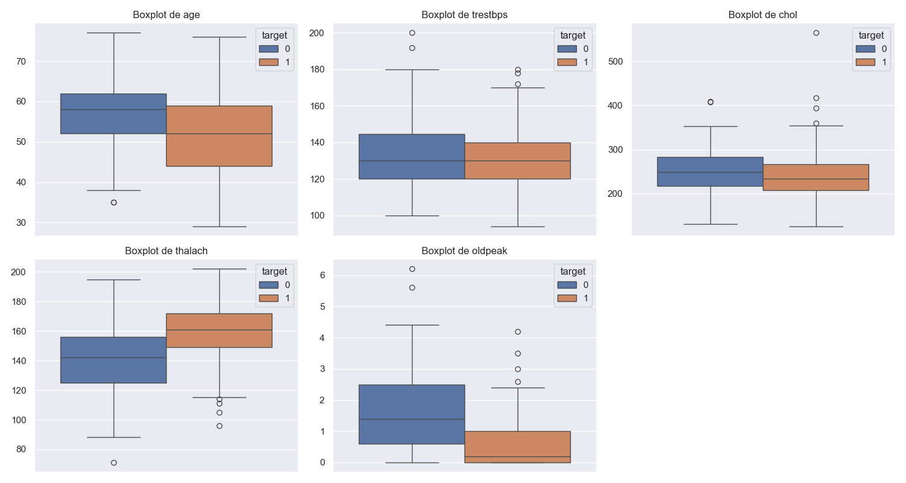
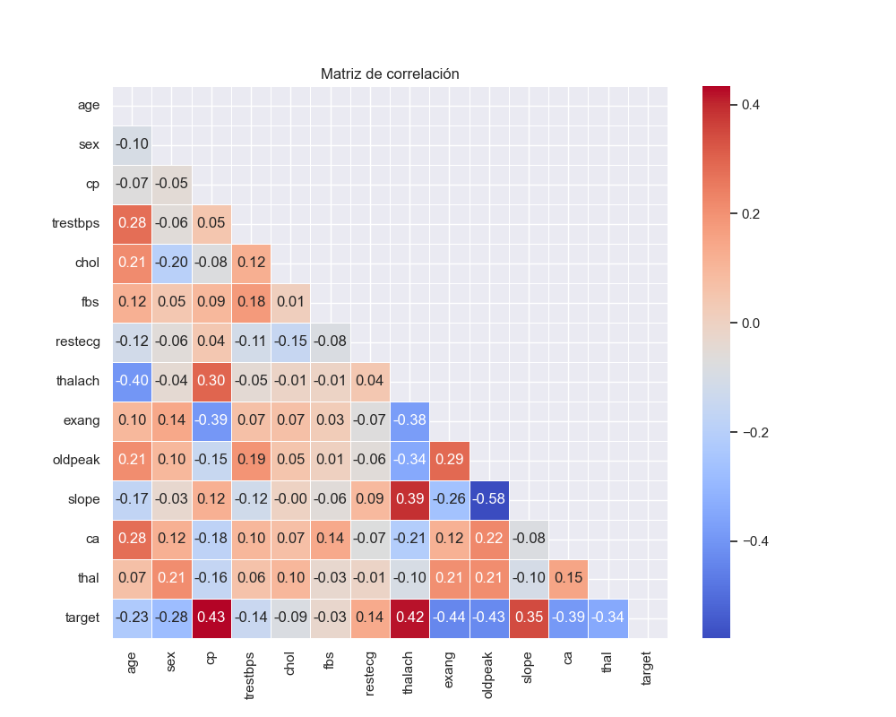

# Exploratory Data Analysis (EDA)

## **Resumen del Dataset**

- **Número total de registros**: 303.
- **Número total de características**: 14 (13 independientes + 1 objetivo).
- **Características categóricas**: `sex`, `cp`, `fbs`, `restecg`, `exang`, `slope`, `ca`, `thal`.
- **Características numéricas**: `age`, `trestbps`, `chol`, `thalach`, `oldpeak`.
- **Distribución entre hombres y mujeres**:
  - Hombres (`sex=1`): 68%.
  - Mujeres (`sex=0`): 32%.
  - **Consideraciones para el modelado**:
    - Este desbalance debe considerarse al entrenar el modelo, aplicando técnicas como estratificación o ponderación de clases para evitar sesgos.

## **Distribución de Clases**

- **Variable objetivo (`target`)**:
  - **1 (Enfermedad cardíaca presente)**: 165 registros (54.46%).
  - **0 (No enfermedad cardíaca)**: 138 registros (45.54%).
- **Observación**:
  - La variable objetivo está relativamente balanceada. No se requerirán técnicas de balanceo como sobremuestreo o submuestreo.

## **Análisis Univariado**

### **Características categóricas**

1. **`sex` (Género)**:
   - **Hombres**: 68% del total.
   - **Mujeres**: 32% del total.
   - **Observación**:
     - Del total de mujeres (`sex=0`), el **75%** tienen enfermedad cardíaca (`target=1`), mientras que el **25%** no tienen enfermedad.
     - En hombres (`sex=1`), las proporciones son más equilibradas: el **44.93%** tienen enfermedad y el **55.07%** no tienen enfermedad.
     - **Conclusión**: La prevalencia de enfermedad cardíaca es mayor en mujeres que en hombres.
2. **`cp` (Tipo de dolor en el pecho)**:
   - **Distribución**:
     - **0 (angina típica)**: Menos prevalente (15%).
     - **1 (angina atípica)**: La mayoría de los pacientes (46%).
     - **3 (asintomático)**: Relación más fuerte con la enfermedad cardíaca (`target=1`).
   - **Conclusión**: El tipo de dolor en el pecho es una característica clave para diferenciar entre pacientes con y sin enfermedad.

### **Características numéricas**

1. **`age` (Edad)**:
   - Rango: 29-77 años.
   - Media: 54 años.
   - **Distribución**:
     - La mayoría de los pacientes están en el rango de **50 a 60 años**.
     - Pacientes mayores de 60 años tienen mayor prevalencia de enfermedad cardíaca.
2. **`chol` (Colesterol sérico)**:
   - Valores >200 mg/dl predominan (indicando riesgo elevado).
   - **Outliers**: Se detectaron **5 valores extremos** superiores a 350 mg/dl.
3. **`thalach` (Frecuencia cardíaca máxima alcanzada)**:
   - Valores altos correlacionados con la ausencia de enfermedad.
4. **`oldpeak` (Depresión ST)**:
   - Valores elevados correlacionados con la presencia de enfermedad.

## **Relaciones clave**

1. **Edad (`age`) vs. `target`**:
   - Los pacientes mayores de 60 años tienen mayor prevalencia de enfermedad cardíaca.
2. **Sexo (`sex`) vs. `target`**:
   - El **75%** de las mujeres tienen enfermedad cardíaca (`target=1`).
   - En hombres, el **44.93%** tienen enfermedad y el **55.07%** no tienen enfermedad.
   - **Conclusión**: Las mujeres tienen una mayor prevalencia de enfermedad cardíaca en comparación con los hombres.
3. **Frecuencia cardíaca máxima (`thalach`) vs. `target`**:
   - Los valores más altos de `thalach` están correlacionados con ausencia de enfermedad.
4. **Depresión ST (`oldpeak`) vs. `target`**:
   - Valores elevados están correlacionados con la presencia de enfermedad cardíaca.

## **Valores atípicos**

- **Colesterol (`chol`)**:
  - **5 outliers detectados** con valores superiores a 350 mg/dl.
  - Estos valores pueden distorsionar el entrenamiento del modelo y deben manejarse mediante transformaciones o eliminación.
- **Presión arterial en reposo (`trestbps`)**:
  - Valores extremos >200 mmHg requieren revisión y podrían ser outliers o errores de medición.

## **Matriz de Correlación**

- **Relaciones más significativas con la variable objetivo (`target`)**:
  - **`thalach`**: Correlación negativa moderada (-0.42).
  - **`oldpeak`**: Correlación positiva moderada (+0.43).
  - **`cp`**: Correlación positiva moderada (+0.43).
  - **`exang`**: Correlación negativa moderada (-0.44).
- **Correlaciones entre variables independientes**:
  - **`oldpeak` y `slope`**: Fuerte correlación negativa (-0.58).
  - **`thalach` y `age`**: Correlación negativa moderada (-0.40).

# **Conclusión general del EDA**

1. **Distribución de datos**:
   - La variable objetivo está balanceada, pero el dataset está desbalanceado en cuanto a género (68% hombres vs. 32% mujeres).
2. **Características clave**:
   - Variables como `cp`, `thalach`, `oldpeak` y `sex` presentan relaciones fuertes o moderadas con la variable objetivo.
3. **Recomendaciones para el modelado**:
   - Considerar el desbalance en `sex` mediante estratificación o ponderación de clases.
   - Analizar y manejar los outliers en `chol` y `trestbps` antes del entrenamiento del modelo.
