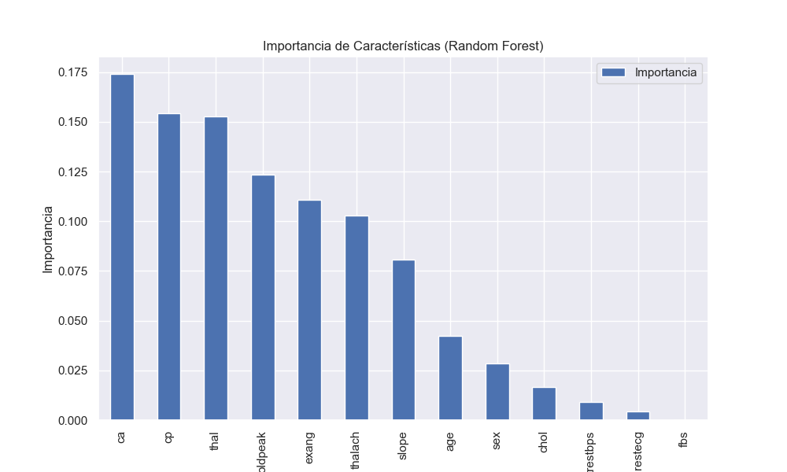
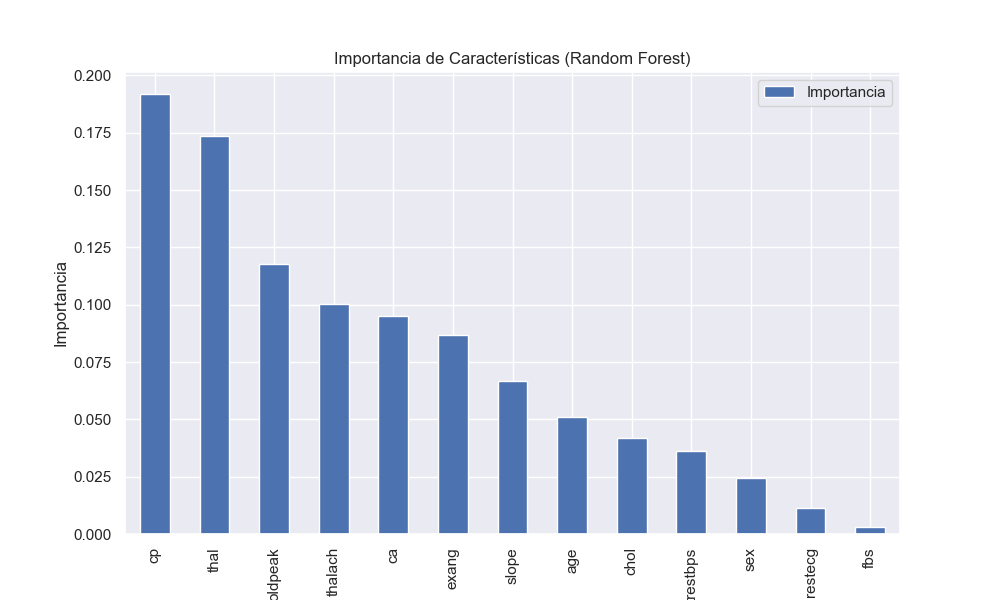
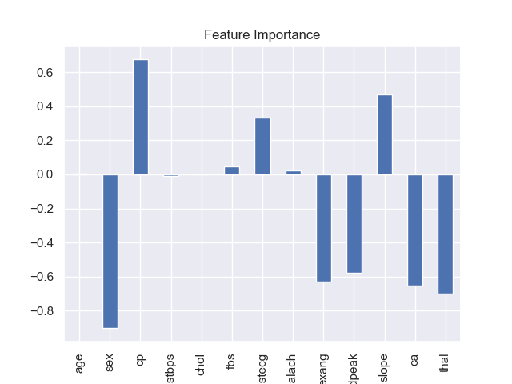
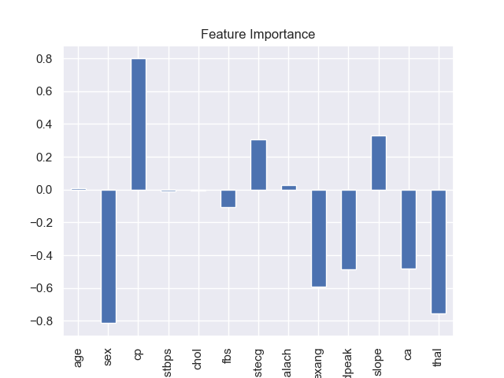
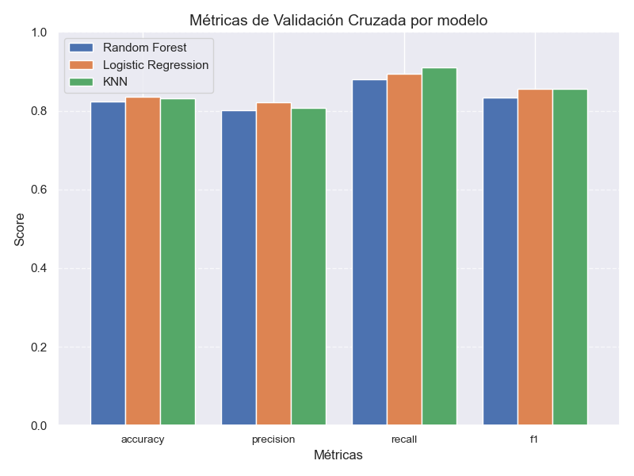

# Resultados y Conclusiones del Modelado

## Introducción
En este documento se resumen los resultados obtenidos durante la etapa de modelado del proyecto de predicción de enfermedades cardíacas. Se evaluaron tres modelos principales: **Random Forest**, **Logistic Regression** y **K-Nearest Neighbors (KNN)**. Se realizaron diferentes configuraciones con y sin estratificación de la variable objetivo y se ajustaron los hiperparámetros utilizando `RandomizedSearchCV` y `GridSearchCV`. Además, se evaluaron combinaciones de modelos mediante **Voting Classifier** y **Stacking Classifier**.

## Rendimiento de los Modelos

#### **Resultados Estratificados**

Se evaluaron los modelos en el conjunto de prueba utilizando estratificación para asegurar que las clases estuvieran proporcionalmente representadas:

| Modelo                | Accuracy | Precision | Recall | F1-Score | ROC-AUC |
|-----------------------|----------|-----------|--------|----------|---------|
| Logistic Regression   | 0.84     | 0.82      | 0.90   | 0.86     | 0.90    |
| KNN                   | 0.82     | 0.80      | 0.90   | 0.85     | 0.90    |
| Random Forest         | 0.84     | 0.84      | 0.89   | 0.87     | 0.91    |

#### **Resultados Sin Estratificación**

Se evaluaron los modelos sin estratificar los datos:

| Modelo                | Accuracy | Precision | Recall | F1-Score | ROC-AUC |
|-----------------------|----------|-----------|--------|----------|---------|
| Logistic Regression   | 0.89     | 0.88      | 0.91   | 0.89     | 0.92    |
| KNN                   | 0.89     | 0.90      | 0.88   | 0.89     | 0.91    |
| Random Forest         | 0.87     | 0.85      | 0.91   | 0.88     | 0.93    |

>[!NOTE]**Observación:** Los resultados **sin estratificación** son ligeramente más altos, pero podrían ser menos representativos en aplicaciones reales, ya que no garantizan que las clases estén proporcionalmente representadas en el conjunto de prueba.

## Importancia de Características

### Random Forest
La importancia de las características calculada con Random Forest muestra que las variables más relevantes son `ca`, `cp`, `thal`, `oldpeak` y `thalach`. A continuación, el gráfico que representa estas importancias:

**Sin estratificación:**

**Con estratificación:**

### Regresión Logística
Los coeficientes del modelo de Regresión Logística muestran cómo cada característica afecta la probabilidad de predecir la presencia de enfermedad cardíaca. Las características más relevantes son `sex`, `cp`, `thal`, `exang`y `ca`:

**Sin estratificación:**

**Con estratificación:**

## Combinación de Modelos

Se evaluaron **Voting Classifier** y **Stacking Classifier** utilizando Random Forest y Logistic Regression. Los resultados obtenidos son los siguientes:

| Clasificador          | Accuracy | Precision | Recall | F1-Score | ROC-AUC |
|-----------------------|----------|-----------|--------|----------|---------|
| Voting Classifier     | 0.89     | 0.88      | 0.91   | 0.89     | 0.92    |
| Stacking Classifier   | 0.89     | 0.88      | 0.91   | 0.89     | 0.92    |

>[!NOTE]**Observación:**
> Ambos clasificadores combinados lograron métricas equivalentes al mejor modelo individual (Random Forest) pero **no mejoraron significativamente los resultados**. Esto sugiere que los modelos individuales ya capturan bien los patrones del dataset.

## Comparación y Observaciones Clave

1. **Impacto de la Estratificación**:
   - Con estratificación, los resultados son más representativos y confiables para escenarios reales.
   - Sin estratificación, se observan métricas más altas, pero existe el riesgo de sobreoptimismo debido a particiones de datos no representativas.

2. **Comparación de Modelos Individuales**:
   - **Random Forest**:
     - Destaca por su robustez, equilibrio entre métricas, y capacidad para capturar relaciones no lineales.
     - Es el modelo más consistente, especialmente bajo estratificación.
   - **Logistic Regression**:
     - Ofrece interpretabilidad y un rendimiento competitivo. Es ideal en aplicaciones donde se prioriza la transparencia.
   - **KNN**:
     - Tiene un excelente `Recall`, lo que lo hace útil para minimizar falsos negativos. Sin embargo, depende del escalado y puede ser computacionalmente más costoso en datasets grandes.

3. **Resultados Finales**:
   - **Random Forest** fue seleccionado como el modelo final debido a su mejor balance de métricas y robustez en validación cruzada.

## Conclusiones Finales

- Los modelos evaluados (Random Forest, Logistic Regression, y KNN) tienen un rendimiento competitivo, con métricas de `Accuracy`, `F1-Score` y `ROC-AUC` en rangos similares.
- La **estratificación** es clave para evaluar el rendimiento del modelo de manera realista y debe ser utilizada en aplicaciones prácticas.
- Aunque Random Forest es el modelo seleccionado, Logistic Regression sería una excelente alternativa en caso de priorizar interpretabilidad.

## Próximos Pasos

1. **Evaluación en Datos Externos**:
   - Validar el modelo en un conjunto de datos externo para confirmar su capacidad de generalización.

2. **Técnicas Avanzadas de Interpretabilidad**:
   - Usar SHAP o LIME para entender mejor cómo las características contribuyen a las predicciones del modelo.

3. **Optimización Adicional**:
   - Probar técnicas de ensamblaje más avanzadas (e.g., Bagging, Boosting).
   - Ajustar hiperparámetros con un mayor rango de búsqueda en Random Forest y Logistic Regression.
